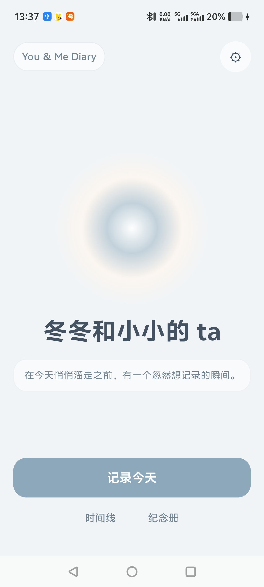
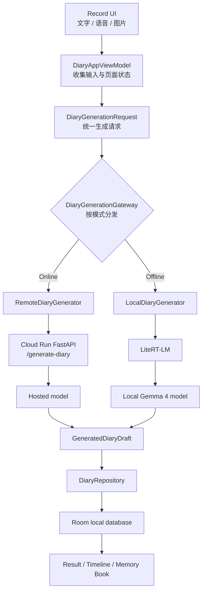

# You & Me Diary

**一个由 Gemma 驱动、默认私密的孕期 AI 陪伴日记。**

`You & Me Diary` 是一个面向孕期的私密 AI 日记 App。它把准妈妈每天的文字、语音和照片，整理成温柔的日记图页，并自动沉淀到时间线和纪念册里。

这个产品刻意不做医疗工具、社交信息流、母婴电商或数据仪表盘。它想解决的是一个更安静的问题：当用户写下“今天有点累”、或者是当那些难以被语言化的emo感觉被图像呈现，可以先被理解被看见，最后再把这一天变成未来妈妈和宝宝都可以回看的记忆。

对于职场女性来说，一般情况下，我们都是很要强的一批人。孕期中的情绪，有些时候难以安放，跟家人说、跟朋友说，似乎都不太合适。我希望通过借助ai的力量，让肚子里的宝宝的回应在想象的空间可以被言语化：也许我们难过的时候，其实宝宝就是在陪着我们的。ta的每一次胎动，就是一次玩耍或者温柔的回应。希望通过这个app的设计，一方面抚平孕期妈妈的情绪焦虑感，一方面在爱自己的过程中，隐性地增加宝宝和自己的连接感。

另外，这是我作为c++程序员，第一次尝试用codex构建一个我不熟悉语言的产品，这个过程中，我用ai实现了一个来自我自己的、很小众的需求的全过程。整体的创造感，让我很开心😊。尤其是调通gemma的端侧模型推理的时候，当我看到“宝宝说：噗噜噗噜”的时候，我切实地感到踏实以及被抚慰。很感谢有这个机会创造这个小产品~

<p align="center">
  
</p>

## 摘要

- **产品方向：** 面向孕期的 Android 私密 AI 陪伴日记。
- **核心闭环：** 记录今天 -> 被理解 -> 生成日记图页 -> 进入时间线 -> 收藏到纪念册。
- **Gemma 使用：** 端侧通过 LiteRT-LM 接入 Gemma 4 离线生成；在线模式通过 Cloud Run 生成 API 支持云端生成链路。
- **Edge AI 价值：** 孕期日记和照片高度私密，端侧模型让敏感记录可以在本机完成生成。
- **Mobile App 价值：** 当前是原生 Android Compose App，不是网页 mock 或一次性聊天机器人。
- **Social Good 价值：** 支持孕期情绪整理和记忆保存，同时严格避开医疗诊断、治疗和用药建议。

## 为什么需要它

孕期中的记录往往散落在相册、备忘录、聊天记录和碎片文字里。很多孕期产品，比如美柚，更关注知识、指标、社区或购物，但用户有时真正需要的是一个不会打扰她的私密空间：把今天的疲惫、胎动、照片和一点点心情，整理成可以回看的日记。

`You & Me Diary` 的设计围绕三个约束：

- **隐私：** 孕期日记和照片非常敏感，因此本地存储和端侧生成是一等能力。
- **情绪语气：** 先接住情绪，再整理记忆；语气温柔、克制、像日记，不像鸡汤或营销文案。
- **安全边界：** 不做诊断，不给治疗方案，不建议药物；高风险孕期描述只做记录和克制提醒，引导用户咨询医生。

## Demo 流程

当前 App 支持完整主流程：

1. 打开首页。
2. 输入今天的文字、语音和/或照片。
3. AI 生成标题、日记正文、小安慰和可选的宝宝回复。
4. 结果自动保存到时间线。
5. 用户可以把喜欢的图页收藏到纪念册。
6. 在 Settings 中切换 Online / Offline 生成模式。

## 当前实现

Android：

- Kotlin、Jetpack Compose、Material 3。
- Room 保存日记、图页、注释和收藏状态。
- DataStore 保存用户名、预产期、主题和生成模式。
- 支持本地图片附件、ROI 裁切、384px JPEG 压缩和主色估算，调用模型产生图卡概要文本和情绪emoji生成。
- 支持显示宝宝回应emoji、轻状态、短句文本（具体见reply policy等）
- 已接入语音输入 MVP：使用 `AudioRecord` 录音，再通过统一 generation gateway 做转写和生成。

AI 与后端：

- 端侧 LiteRT-LM local Gemma client 读取模型路径（当前是直接使用adb传到手机上的，下载功能尚未完成）：

```text
/sdcard/Android/data/com.youandme.diary/files/models/gemma-4-E2B-it.litertlm
```

- FastAPI 后端提供：

```text
GET  /health
GET  /version
POST /generate-diary
POST /transcribe-voice
```

- Cloud Run 部署地址：

```text
https://you-and-me-diary-api-265810336333.asia-east1.run.app
```

- `/generate-diary` 和 `/transcribe-voice` 使用 `X-App-Token` 保护。
- Secret 通过 Google Secret Manager 管理。
- API key 缺失、模型失败、JSON 解析失败、网络失败或端侧模型失败时，App 会回落到本地 fallback，保证日记主流程不断。

## 架构



Android 主要目录：

```text
app/src/main/java/com/youandme/diary/
  app/                     App 级状态和 enum mock 导航
  feature/                 Compose 页面
  core/designsystem/       共享 Compose 组件
  domain/model/            UI/domain 模型
  data/local/              Room 本地存储
  data/settings/           DataStore 设置
  data/generation/         online/offline 生成 gateway
  data/localai/            LiteRT-LM local Gemma 接入
  data/remote/             Cloud Run API client
```

后端主要文件：

```text
backend/
  app.py
  schemas.py
  prompt.py
  online_gemma_client.py
  voice_transcription_client.py
  baby_reply_policy.py
  diary_fallbacks.py
  generation_settings.py
```

## 隐私与安全

- App 不提供医疗诊断、治疗方案、用药建议，也不能替代医生判断。
- 高风险孕期描述不会交给“宝宝说”承担提醒，而是通过克制的 safety note 处理。
- 后端设计上避免记录完整用户日记原文或 base64 图片。
- 在线图片请求只上传用户选择 ROI 后的压缩图，不上传完整原图。
- Offline 模式在本地模型存在时，可在设备上完成生成。
- 当前 demo build 需要预置本地模型文件；生产版本的模型下载、校验和断点续传是后续 roadmap。

## 运行方式

Android 构建：

```powershell
.\gradlew.bat :app:assembleDebug
.\gradlew.bat :app:testDebugUnitTest
```

如果当前 shell 找不到 `java`，可以临时把 `JAVA_HOME` 指向 Android Studio 自带 JBR。

后端本地启动：

```powershell
cd backend
python -m venv .venv
.\.venv\Scripts\Activate.ps1
pip install -r requirements.txt
uvicorn app:app --reload
```

后端测试：

```powershell
python -m pytest backend
```

Cloud Run 版本确认：

```powershell
Invoke-RestMethod -Uri 'https://you-and-me-diary-api-265810336333.asia-east1.run.app/version'
```

## Demo Build 说明

离线 Gemma 路径需要先把 LiteRT-LM 模型放到：

```text
/sdcard/Android/data/com.youandme.diary/files/models/gemma-4-E2B-it.litertlm
```

然后在 Settings 中切到 `Offline`。近期 Android 真机已经验证真实 Record UI 图片 + 文本生成，结果 source 为 `local-gemma-gpu`；热启动图片 + 文本生成最近稳定约 5.5-6.9s。

在线路径需要通过本机 `local.properties` 或环境变量注入 backend app token，不提交到仓库；用 `/version` 确认 Cloud Run revision。

## 相关材料

- 技术报告：[docs/hackathon/gemma-hackathon-technical-report.md](docs/hackathon/gemma-hackathon-technical-report.md)
- 当前项目状态：[docs/current-state.md](docs/current-state.md)
- 产品与 UI 决策：[docs/design-decisions.md](docs/design-decisions.md)
- 构建说明：[docs/build.md](docs/build.md)

## Roadmap

- 增加用户可见的模型状态、下载/预置引导和完整性校验。
- 完成语音转写真机验证，尤其是离线音频支持。
- 打磨宝宝回复为空时的分享长图布局。
- 补充端侧模型初始化、热启动推理、耗电和发热记录。
- 准备稳定提交 APK，并固定最终 Cloud Run revision。
