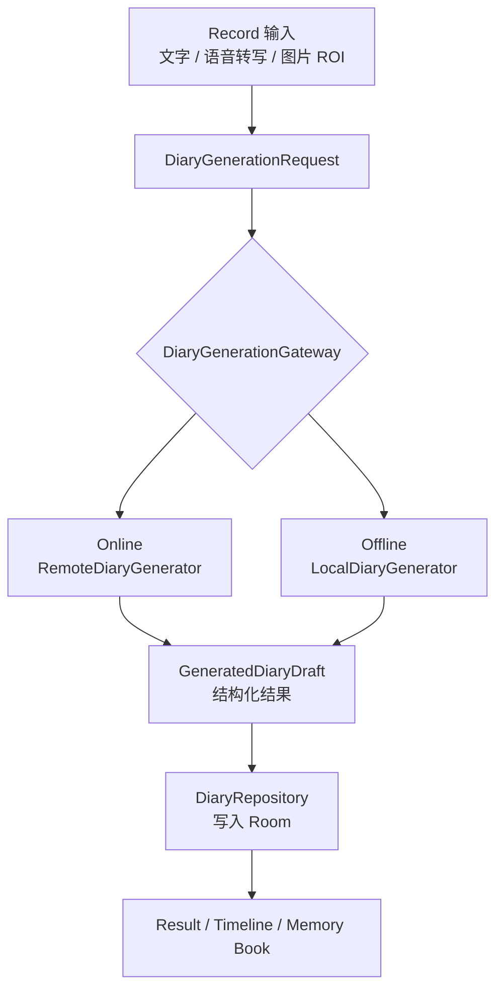
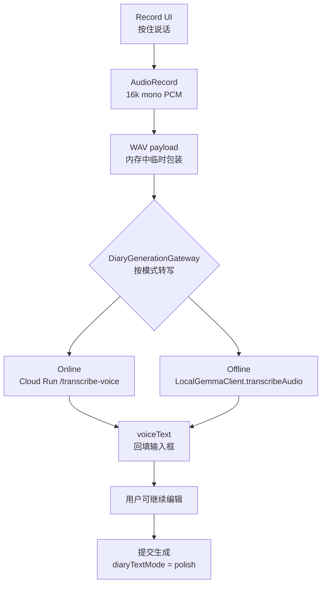
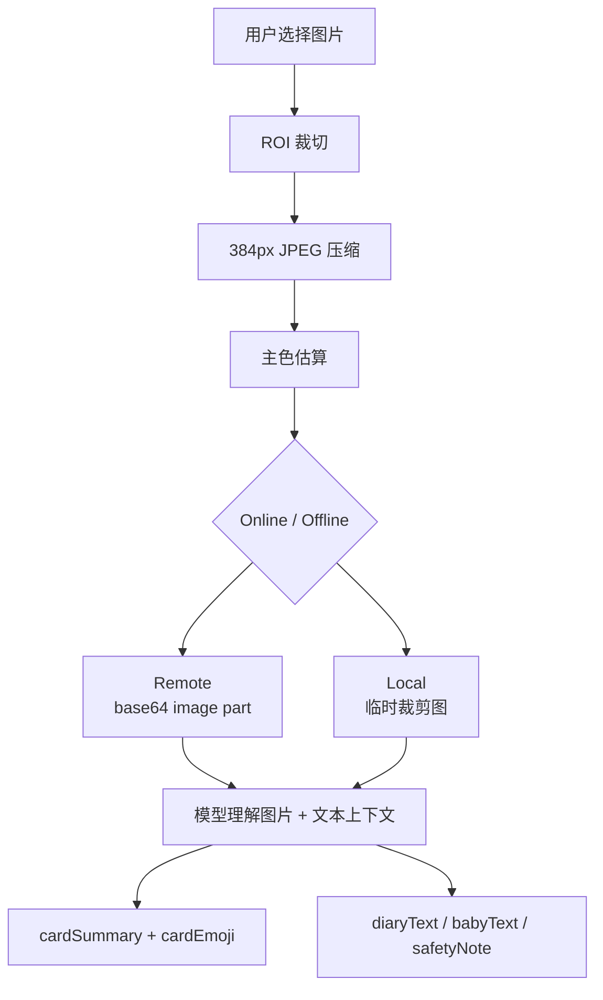
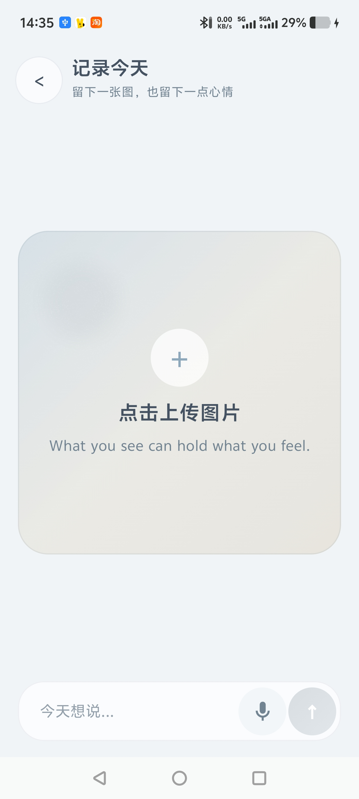
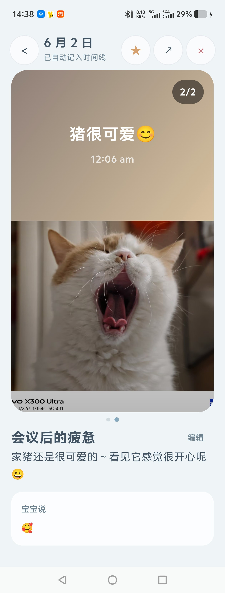
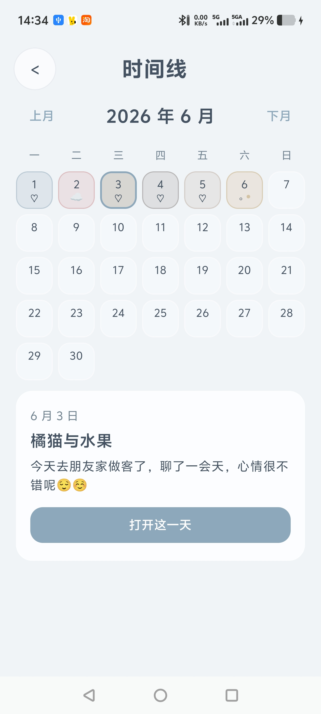
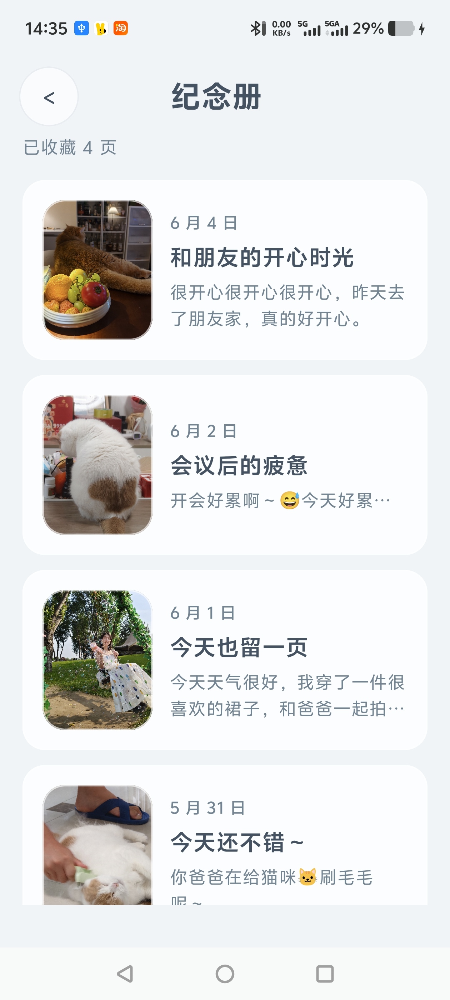
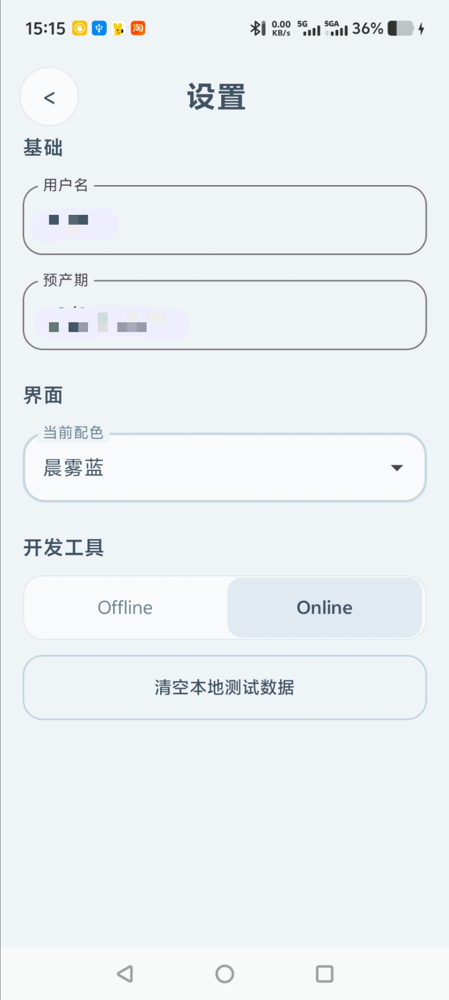

# Gemma 4 Hackathon 技术报告

## 1. 摘要

`You & Me Diary` 是一个面向孕期的私密 AI 陪伴日记 App。它把用户当天的文字、语音和照片整理成可回看的日记图页，并保存到本地时间线和纪念册；通过统一 generation gateway 同时支持 Cloud Run 在线生成和 LiteRT-LM 端侧 Gemma 4 离线生成，并把多模态模型打造成一个有温度的情绪价值供给者。

## 2. 整体链路

用户在 Record 页输入文本、语音转写文本和/或图片后，App 会构造统一的 `DiaryGenerationRequest`。这个 request 不直接绑定 online 或 offline 实现，而是交给 `DiaryGenerationGateway` 按 Settings 中的 generation mode 分发。

Result 展示当前日记图页，Timeline 保存完整日常，Memory Book 保存用户主动收藏的精选记忆。

## 3. Gemma 能力链路

Gemma 在当前 App 中主要承担两件事：一是把语音记录转成可编辑的文字输入，二是理解图片和文本上下文并生成日记图页需要的结构化内容。它的作用不是“写一段回答”，而是把自然输入转成可保存、可回看、可编辑的产品对象。

一开始我想用 online 的多模态模型来做，但实测线上部署的 Gemma 模型返回较慢，大约 40-50s 左右。后来在线路径暂时切换到 gemini flash模型，把返回速度压到 4-5s 量级。总体而言，当前demo版本我还是先保留了online、offline两种模式，参赛核心 Gemma 4 能力还是集中在端侧 Offline 路径；Online 模式使用 gemini-2.5-flash-lite 作为 demo 稳定性兜底，不作为 Gemma 4 参赛亮点。

### 3.1 语音链路

语音输入解决的是孕期记录里的另一个真实问题：用户疲惫、焦虑或身体不舒服时，不一定愿意打字。当前版本已经接入语音输入 MVP，但语音不会直接触发生成，而是先转写成用户可见、可编辑的文本，再进入统一生成链路。

语音链路技术边界：

- `AudioRecord` 采集 16k mono PCM bytes，不保存音频文件路径，降低用户误解和隐私风险。
- Online 模式把 PCM bytes 包装成 WAV 后调用 Cloud Run `/transcribe-voice`，接口同样使用 `X-App-Token` 保护。
- Offline 模式预留并接入 `LocalGemmaClient.transcribeAudio(...)`，把 WAV bytes 传给 LiteRT-LM `Content.AudioBytes`。
- 转写完成后回填到输入框，用户可以修改，不会在松手后自动生成日记。
- 提交时通过 `voiceText`、`inputSource=voice/mixed` 和 `diaryTextMode=polish` 告诉生成模型：这段内容来自语音，需要轻微整理断句和错字，但不能改写用户本意。

语音进入最终日记生成时，有两次模型相关调用：

| 阶段   | 目的               | 输出                    |
| ---- | ---------------- | --------------------- |
| 录音结束 | 将音频转写成文本         | `voiceText`           |
| 用户提交 | 将文字、语音转写和图片整理成日记 | `GeneratedDiaryDraft` |

这个设计避免了“语音识别一结束就直接生成”的失控感，也让用户在敏感表达进入模型整理前有一次确认机会。

### 3.2 图像理解与图卡生成

图片不是简单作为附件保存。它参与模型输入，并影响日记图页的视觉语义、图卡短句和情绪表达。

图像链路的关键点：

- 用户选择图片后，App 按 ROI 裁切，只处理用户实际选择的视觉区域。
- 图片统一压缩到 384px JPEG，降低上传体积，优化推理响应速度。
- `DiaryGenerationImageProcessor` 同时服务 online 和 offline，避免两条路径的图片理解行为漂移。
- Online 模式把压缩图作为 base64 image part 上传到 Cloud Run。
- Offline 模式把压缩图写成 local 临时图片，推理结束后清理。
- 模型输出 `cardSummary` 和 `cardEmoji`，让 Result 和 Timeline 能用短句 + emoji 表达当天状态。

模型输出字段说明：

| 输出字段              | 用途                                       |
| ----------------- | ---------------------------------------- |
| `titleSuggestion` | 当天第一条记录可作为 diary entry 标题。               |
| `diaryText`       | 写入当前图页/注释正文，成为 Result 和 Timeline 可回看的内容。 |
| `babyText`        | 可选宝宝回复；通过策略控制出现频率，避免每次强行输出，从而避免鸡汤化。      |
| `safetyNote`      | 高风险孕期描述的克制提醒，不提供药物说明支持。                  |
| `cardSummary`     | 图卡上的短句，控制在短文本范围内，适合视觉展示。                 |
| `cardEmoji`       | 情绪 emoji，用于图卡和时间线的轻量状态表达。                |
| `source`          | 调试和验证字段，用于区分 online、local、fallback。      |

Prompt 和后处理围绕以下约束设计：

- 先理解用户感受，再整理成日记，不输出客服式总结。
- 宝宝回复短、克制、可为空，不把宝宝说做成每条都出现的鸡汤文。
- 高风险描述不诊断、不治疗、不建议药物，只提醒咨询医生。
- 模型输出必须能被解析成结构化结果，否则进入 fallback。

每次记录的日记都会出现在时间线上，附加一个小 emoji 和色块进行记录。若用户选择收藏，则日记会出现在纪念册中，后期方便从纪念册界面进入查看精选的记忆。

### 3.3 Online 与 Offline 分发架构

项目没有把 remote/local 分支堆在 ViewModel 里，而是通过生成层收敛复杂度。

| 模块                              | 职责                                                     |
| ------------------------------- | ------------------------------------------------------ |
| `DiaryAppViewModel`             | 收集 UI 状态、计算日期、输入来源和正文模式，调用 gateway。                    |
| `DiaryGenerationRequest`        | 统一描述本次生成需要的文字、语音、图片、日期和用户设置。                           |
| `DiaryGenerationGateway`        | 根据 Settings 中的 generation mode 选择 online 或 offline。    |
| `RemoteDiaryGenerator`          | 适配 Cloud Run `/generate-diary` 请求，处理 remote 图片 base64。 |
| `LocalDiaryGenerator`           | 适配 LiteRT-LM local Gemma 请求，管理 local 临时图片。             |
| `DiaryGenerationImageProcessor` | 集中处理 ROI、JPEG 压缩、主色估算和 remote/local 图片准备。              |
| `DiaryRepository`               | 负责落库和 fallback，确保用户记录不会因为模型失败丢失。                       |

这个拆分带来的好处：

- ViewModel 不需要理解 remote/local 的请求细节。
- 图片处理策略保持一致，避免 online/offline 行为漂移。
- 后续加入模型下载、更多端侧能力或替换 online endpoint 时，不需要重写页面状态。
- fallback 在 repository 兜底，用户提交记录后主流程不断。

### 3.4 设计实现要点总结

孕期日记天然包含身体感受、情绪波动、家庭照片和胎动描述，这些内容比普通工具类输入更私密。结合端侧模型，以下功能可以更好地在当前产品mvp中被完成。

| 创新点                                      | 说明                                          |
| ---------------------------------------- | ------------------------------------------- |
| 从 AI chat 变成 AI memory page              | 模型输出不是一次性聊天回答，而是变成可保存、可收藏、可回看的日记图页。         |
| 妈妈视角 + 宝宝轻回应                             | 日记主体先接住妈妈的感受，宝宝回复作为轻量陪伴出现，并且允许为空，避免强行拟人化。   |
| Timeline + Memory Book 双层记忆结构            | Timeline 保存完整日常，Memory Book 只保存用户主动收藏的精选记忆。 |
| 同一 Android App 支持 online/offline gateway | 用户可以在稳定在线生成和端侧私密生成之间切换，页面层不需要理解底层模型差异。      |
| 端侧 Gemma 用在真实隐私场景                        | Offline Gemma 不是技术炫技，而是回应孕期日记、照片和情绪表达的隐私需求。 |

已知当前限制：

- Demo build 需要预置本地模型文件，模型下载、完整性校验和断点续传尚未完成。

## 4. 功能完成度列表

| 功能 / 场景         | 当前状态        | 说明                                      |
| --------------- | ----------- | --------------------------------------- |
| Settings配置      | 已完成         | 用户信息首页展示联动，配色切换功能完成、开发者相关功能完成。          |
| 语音转写 online     | 已完成         | FastAPI /transcribe-voice 接口调用支持语音转写。   |
| 语音转写 offline    | 已完成         | 端侧音频转写链路已接入，已验证转写质量和模型音频支持。             |
| Record 文本生成     | 已完成         | 用户输入文字后，可进入生成链路并落成日记内容。                 |
| 图片 + 文本 online  | 已完成         | 在线模式通过 Cloud Run 生成图卡内容和日记正文。           |
| 图片 + 文本 offline | 已完成         | 端侧 Gemma 路径已通过真实 Record UI 图片 + 文本生成验证。 |
| Timeline        | 已完成         | 日记记录会进入本地时间线，支持后续回看。                    |
| Memory Book     | 已完成         | 用户主动收藏的页面会进入纪念册。                        |
| 模型下载            | 未完成，demo 预置 | 当前 demo build 使用预置本地模型文件。               |
| record页分享长图渲染   | 有已知布局问题     | 仍需继续打磨布局。                               |

## 5. 隐私、安全与边界处理

| 风险                     | 当前处理                                                     |
| ---------------------- | -------------------------------------------------------- |
| 日记文本和孕期照片敏感            | Room 本地保存；Offline 模式可在设备上生成。                             |
| 在线上传图片过多暴露隐私           | 只上传用户选择 ROI 后的 384px 压缩 JPEG，不上传完整原图。                    |
| 语音内容敏感                 | 录音只作为内存中的 PCM/WAV payload 进入转写，不保存音频路径。                  |
| 后端日志泄漏原文或图片            | 后端设计上避免记录完整用户日记原文和 base64 图片。                            |
| API key 或 app token 泄漏 | Secret Manager 管理后端 secret；Android token 通过本机配置注入，不提交仓库。 |
| 模型输出医疗误导               | Prompt 和策略约束不诊断、不治疗、不建议药物。                               |
| 高风险孕期症状被宝宝口吻回应         | `safetyNote` 与 `babyText` 分离，宝宝回复不承担医疗提醒。                |
| 模型失败或 JSON 解析失败        | 返回 `null` 后由 repository fallback，记录仍可保存。                 |
| 网络不可用                  | 可切换 offline；online 失败不阻断本地记录链路。                          |
| 本地模型缺失                 | 当前 demo 预置模型；后续可以计划补模型状态、下载和校验。                          |

## 6. Demo截图

Home：日记入口

  

Record：文字/语音/图片输入

  

日记页：模型输出落成图页

  

Timeline：本地长期回看

  

Memory：主动收藏

  

Settings：Online/Offline 模式、配色方案可切换

  

